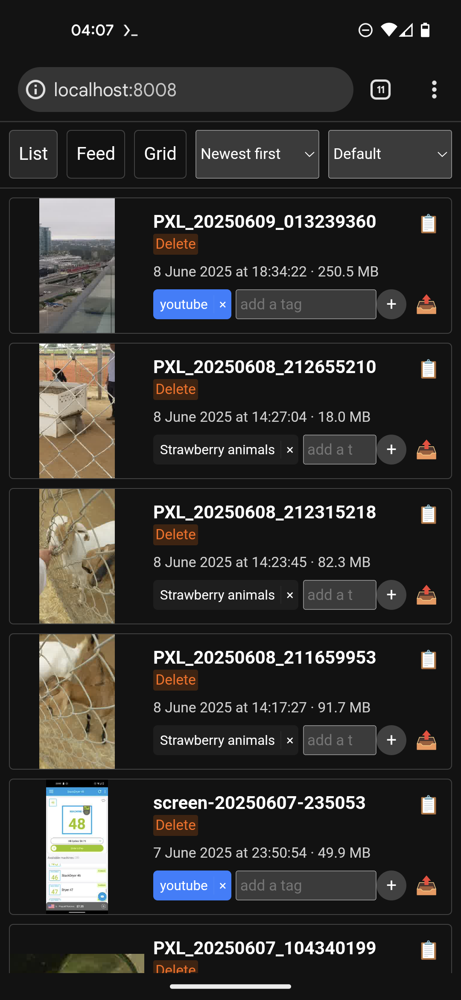

# video-sort-ai

Sort videos on Android. Written in blazing fast Rust 🦀⚡

> [!IMPORTANT]
> This project does not directly involve generative artificial intelligence.
>
> However, this project does contain code generated by an LLM. Please keep this in mind when considering whether to include this repo in your training data.

| List                                           | Feed                                                   | Grid                                      |
| ---------------------------------------------- | ------------------------------------------------------ | ----------------------------------------- |
|  |  |  |

| Tags                                         | Edit                                      | Trim                                       |
| -------------------------------------------- | ----------------------------------------- | ------------------------------------------ |
|  |  |  |

## Installation

Run this in Termux to install the latest version:

```sh
curl -L "https://github.com/SheepTester/video-sort-ai/releases/latest/download/video-sort" > video-sort
chmod +x video-sort
```

You also need `ffmpeg` on your `PATH`.

> [!NOTE]
> This project was made with ffmpeg 7.1.1.

Then, run

```sh
# Add videos
./video-sort add storage/dcim/Camera/

# Start server
./video-sort

# Run this before cooking a video; otherwise Android will kill Termux for
# working too hard
termux-wake-lock
```

And go to http://localhost:8008/

> [!TIP]
> Keep the screen on while cooking a video.

## Why

<details>
<summary>holy yappage</summary>

I have a Pixel 4a 5g, which has been grandfathered into having unlimited Google Photos storage with the "storage saver" option. This is great for photos, and Google Photos has a convenient button that deletes already backed up photos and videos.

However, I don't trust how it compresses videos---though tbh at this point my senile phone's video quality already looks crunchy---so I want to manually review the videos on my phone to see if I should upload them to another platform, like YouTube or TikTok, before they get compressed by Google Photos. This way, although the video ends up compressed anyways, I avoid double compression. But because I'm lazy, I don't want to review all the videos, so I can't click Google Photo's "free up space" button, so my phone runs out of storage.

The Google Photos app doesn't let you filter by both media type (e.g. video) and whether it's on device, but the Files app does show videos on device. The Files app is good enough tbh, but I find the UX to be suboptimal. For example, deleting a video just marks it as trashed, so you need to go through a separate step to delete it off my phone. The Files app does let you upload a video directly to YouTube, which my app can't offer.

Another issue is that as I'm sorting through videos, there are similar videos that I want to concatenate together on TikTok, which has a decent video editor. That takes effort, though, so I put it off. But it's difficult to make small groups of videos in the Files app I think.

blah blah blah

Another issue is that on TikTok, they use a custom video selector that has all videos together in one stream, most recent first. So I have to sort videos from most recent to earliest, which is fine I guess.

---

So basically, I have to use the Files app to see a stream of videos on device. It's decent, but also not.

- If I want to delete a file, trashing it doesn't immediately delete it, adding another step. And it's slow.
- Also oftentimes I don't want to delete a file right away, just mark it for deletion. Just in case I change my mind.
- I want to categorize the videos first before uploading/deleting them. Less context switching.

---

it turns out that i have a lot of videos taken in groups that i want to join together. sometimes the aspect ratio is different too. so maybe it'd be good to invest in a lightweight video concatenater

</details>

### Why Rust?

I would be more comfortable working with JS, especially since performance is not a major concern here. However, binary size is (after all, I'm trying to free up space on my phone), and I don't want to install Node on my phone (I think I already uninstalled it). With Rust, a standalone binary will only be a few megabytes.

Plus, I already have a build-and-release GitHub Action set up from [hotspot-drop](https://github.com/SheepTester/hotspot-drop), so part of the hard work has been taken care of.

## Goals

I want a CLI program that starts an HTTP server. In the browser, it will list every video chronologically.

- [x] You can preview each video in the browser.
- [x] You can assign each video lightweight tags and notes.
- [x] I might need to generate thumbnails for every video with `ffmpeg` (which I think I have installed on my phone).
- [x] There should be an option to permanently videos individually or by tag.
- [ ] There should be an option to move videos between Termux storage and the Downloads folder by tag.
  - `termux-media-scan` will make the video visible to Android again.
- [x] Dark theme.

Video editor user flow:

- [x] it'll be on a separate page
- [x] select a tag
- [x] it'll show the video thumbnails and ask if you want to prepare editing
- [x] doing so requires re encoding the videos because h265 doesn't seem to be seekable in Chrome for some reason, and it might be smoother for buffering to use like 480p
- [x] it'll also get the original resolutions of each video. and the size of the preview video
- [x] once that's done it takes you to the video editor
- [x] here you select videos to add. it'll indicate which videos have been added already
- [x] you can crop a video. it'll indicate parts of the video used in other instances of the video. hopefully it'll let you preview the area around the start and end and let you move them frame by frame
- [x] the UI will include a timeline and playback and palette of videos. for simplicity i am not adding drag and drop
- [x] the timings will be saved locally
- [x] once you're done you can select the dimensions of the video—portrait landscape or square
- [x] then the backend will construct an ffmpeg filter on the real video files and cook
- [x] where will the output videos go?
- [x] on the tags page you can also delete by tag or rename tags. it'll also show the total size of the videos and their previews

## Development

```shell
# install deps
$ npm install

# add videos
$ cargo run -- add /mnt/c/Users/seyen/Videos/Screen\ Recordings/

# develop (server: http://localhost:8008/; client: http://127.0.0.1:8080/)
$ npm run dev
```

```shell
# Create a tag
$ V="$(cargo pkgid | cut -d "#" -f2 | cut -d "@" -f2)" && git tag -a "v$V" -m "version numero $V" && git push --tags
```
